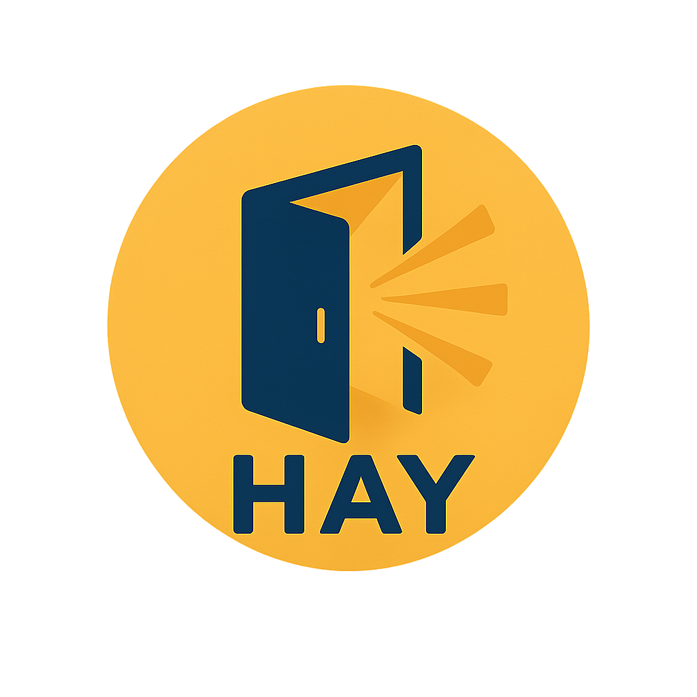

# OpenHay

  

  <strong>An Vietnamese open-source, self-hostable implementation of a AI search and research platform.</strong>

    
    
    

---

## Live Demo

Check out the live deployed version of OpenHay at https://www.openhay.vn

Note that usage is limited and system may raise overload error.

---

## About The Project

[AIHay.vn](https://ai-hay.vn/) is a prominent Vietnamese startup that recently [raised over $10M in funding](https://news.tuoitre.vn/vietnamese-ai-startup-raises-10mn-in-series-a-funding-103250703165541286.htm) for its generative AI-powered knowledge platform.

**OpenHay** is an open-source implementation of its core features, developed by 2 engineers. The goal is to provide a powerful, self-hostable AI companion that is free to use for anyone with their own API keys, removing the need for a paid subscription.

## Core Features

-   **Q&A with Citations**: Delivers reliable, LLM-generated answers with citations extracted from web sources.
-   **Daily News Gathering**: An autonomous agent crawls predefined Vietnamese news sites, using an LLM to select and summarize the most significant articles. For technical details, see the [**Discover Agent README**](./backend/core/agents/discover/README.md).
-   **Deep Research Agent**: A hierarchical, multi-agent system for conducting in-depth, autonomous research. It parallelizes web investigation across multiple sub-agents and synthesizes their findings into a final, cited report. This system is optimized for performance and cost-efficiency using `gemini-3-flash-preview`. For a detailed architectural breakdown, read the [**Research Agent README**](./backend/core/agents/research/README.md).
-   **Translation**: Translates content from web links or uploaded documents (PDF, DOCX, etc.) while preserving context and technical terms.

## Getting Started

To deploy a local instance, follow the setup instructions in the respective directories:

-   **[Backend Setup](./backend/README.md)**
-   **[Frontend Setup](./frontend/README.md)**

The system operates on a "bring-your-own-key" model. You will need API keys for services like Google AI (for Gemini models), Brave API (for web search) which typically offer a free tier sufficient for personal use.

## Development & Support

Contributions are welcome.

### Contributing

This project enforces `pre-commit` and `conventional-commit` standards to maintain code quality and a structured commit history.

1.  Fork the repository.
2.  Create your feature branch (`git checkout -b feature/NewFeature`).
3.  Install hooks: `pre-commit install`.
4.  Commit your changes with a conventional message (`git commit -m 'feat: Add NewFeature'`).
5.  Push to your branch (`git push origin feature/NewFeature`).
6.  Open a Pull Request.

### Code of Conduct

All contributors are expected to adhere to our [Code of Conduct](./CODE_OF_CONDUCT.md).

### Support

For questions or issues, please contact:
-   **Primary Contact**: Quang Pham via [quangphamm1902@gmail.com](mailto:quangphamm1902@gmail.com).
-   **Issues**: Use the [GitHub Issues tracker](https://github.com/your-repo/openhay/issues) for bugs and feature requests.

## License

Distributed under the MIT License. See the `LICENSE` file for more information.
