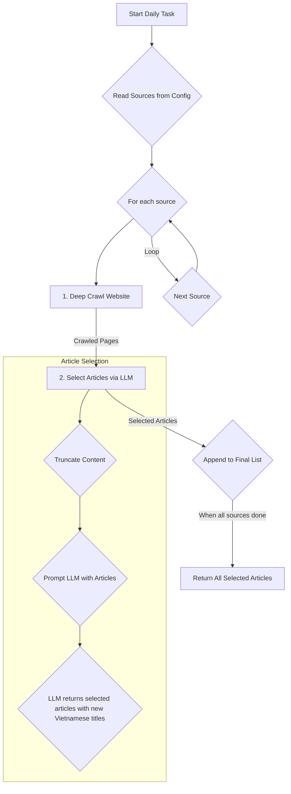

# Discover Agent

The Discover Agent automates daily news gathering. It crawls a predefined list of Vietnamese news sources, uses an LLM to select the most relevant articles, and generates concise Vietnamese titles.

## Architecture

The agent processes each configured news source sequentially.

### Workflow

1.  **Configuration**: The agent reads a list of target news websites from `discover_sources_config` in the settings. Each source configuration specifies the entry URL, crawl depth, page limits, and URL patterns.

    > **To add more news sources**, append a new source configuration to the `discover_sources_config` list in your `settings.py` file.

2.  **Deep Crawl**: For each source, the agent performs a deep crawl using a Breadth-First Search (BFS) strategy, collecting a pool of potential articles based on the configured URL patterns.

3.  **LLM-Powered Selection**: The crawled content is truncated and sent to the `discover_model` LLM, which selects the most significant articles based on a source-specific prompt.

4.  **Title Generation**: The LLM also generates a new, short, and engaging title in Vietnamese for each selected article.

5.  **Aggregation**: The selected articles are added to a final list. The agent then proceeds to the next configured source.

6.  **Completion**: Once all sources are processed, the agent returns a flat list of all selected articles, which is used to populate the "Daily Suggestions" feature.
