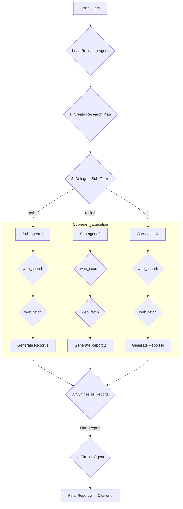

# Research Agent

The Research Agent is an autonomous system designed for in-depth research. It uses a hierarchical, multi-agent architecture to parallelize information gathering and synthesis, producing a comprehensive, cited report for a given query.

## Architecture

The system comprises a **Lead Research Agent**, multiple **Sub-agents**, and a **Citation Agent**.

### Workflow

1.  **Planning**: The `Lead Research Agent` receives a user query and formulates a research plan, decomposing the topic into parallelizable sub-tasks.

2.  **Delegation**: The lead agent delegates each sub-task to an available `Sub-agent` with a detailed prompt.

3.  **Execution (Sub-agents)**: Each sub-agent operates independently in parallel. Its primary tools are:

    - `web_search`: Discovers relevant URLs.
    - `web_fetch`: Retrieves full content from discovered URLs.
      Each sub-agent produces a report summarizing its findings.

4.  **Synthesis**: The `Lead Research Agent` gathers the reports from all sub-agents and synthesizes them into a single, cohesive final report.

5.  **Citation**: The synthesized report and the history of fetched URLs are passed to the `Citation Agent`, which:
    - Attributes claims in the report to their sources.
    - Inserts inline numeric citations (e.g., `[1]`, `[2]`).
    - Generates a bibliography mapping citations to source URLs and titles.

This architecture ensures the final output is thorough, verifiable, and well-supported by evidence. The use of `gemini-2.5-flash` optimizes for speed and cost.
